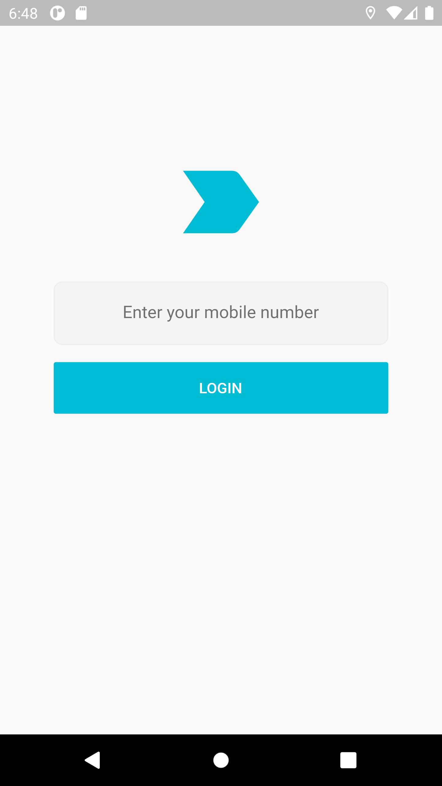
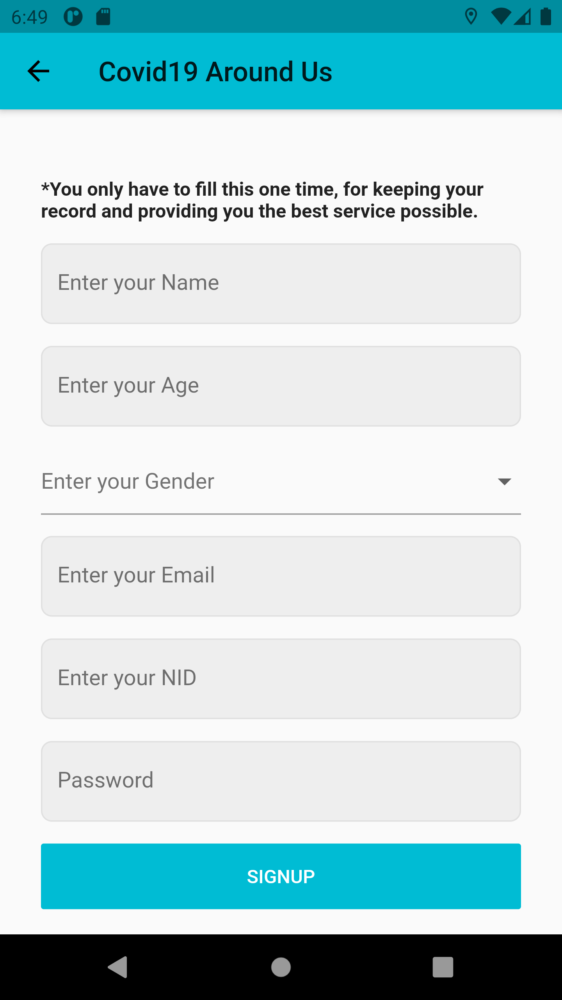
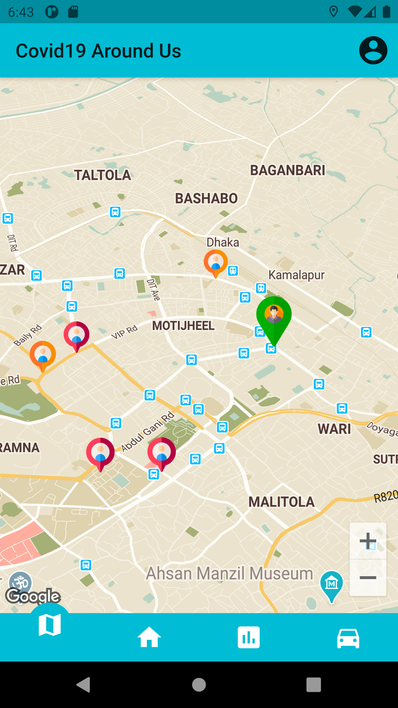
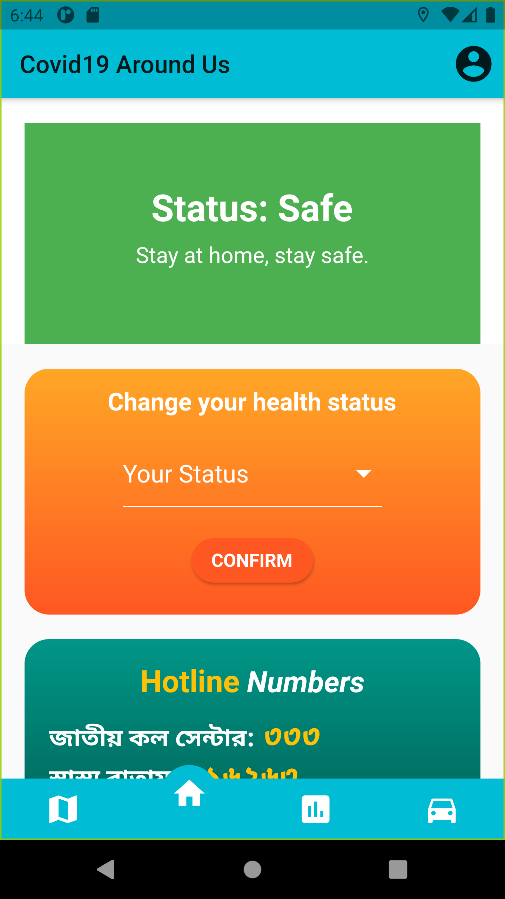
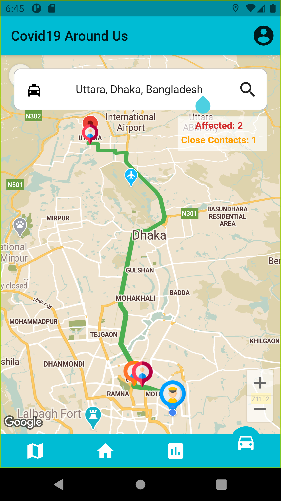

# COVIDAroundUs - Social distancing made easier
# Abstract

With the current pandemic at hand, the world is in turmoil however, we are finding ways to survive. Taking the symptoms and the causes at hand, this paper proposes a mobile application that keeps track of the infected in a certain area or country. With the help of a location-based recommendation, the infected persons position will be uploaded to cloud system where it will mark a certain amount of area around the person as a danger zone for those uninfected. With geospatial hotspot and location-based services, we can get readings of gatherings in our map, highlighting them in red so users can stay aloof of that position. Moreover, regular updates on COVID-19 based on the area they select will be provided through a real-time notification system. This mobile app will use GPS data to pinpoint a user’s location accurately. Data about the infected and the uninfected will be provided by the local hospitals and other medical institutions battling COVID-19. We conducted experiments that confirm the accuracy and effectiveness of our proposed strategy.

https://ieeexplore.ieee.org/document/9430253

**Team:** Iftiaz Ahmed, Sajid Ahmed, Fatematuj Zahura, Ziad Hossain and Dr. Md. Mahfuzur Rahman

# Screenshots

  
  
  
  
  

